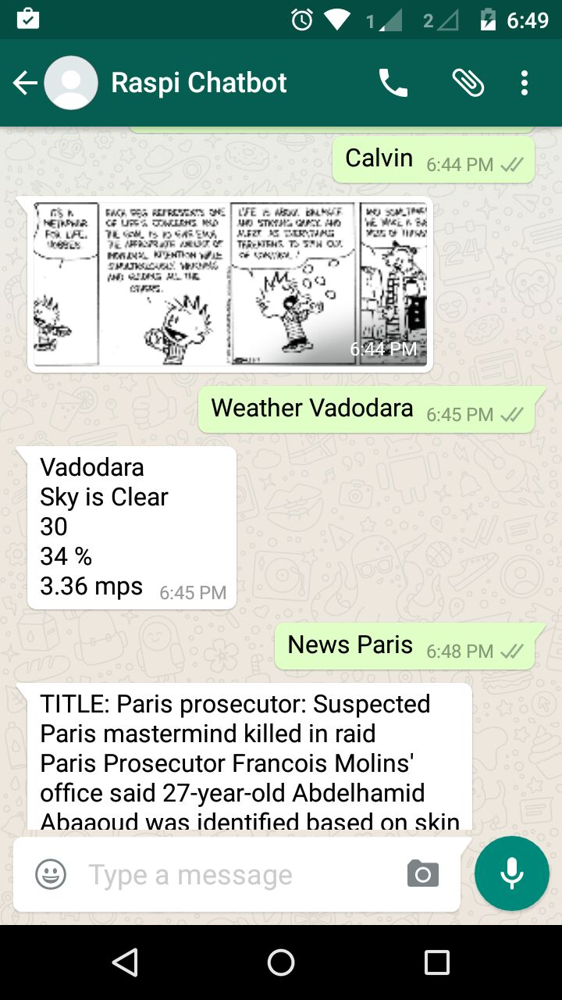

# Raspberry-Pi-Chatbot
Raspberry Pi Chatbot developed as part of my EL203: Embedded Harware Design Coures

The project has been built over the <a href="https://github.com/tgalal/yowsup">yowsup</a>.

Here is a Screenshot of Raspi Chatbot in action  
</img>
